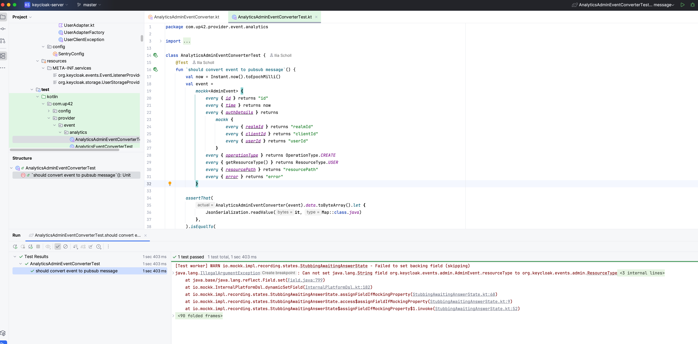

# test-video-in-readme

test t.2

test t.1

test a

test b

test c

test d
<video width="320" height="240" controls>
  <source src="/docs/media/sandbox-password.mp4" type="video/mp4">
</video>

test e
<video width="320" height="240" controls>
  <source src="/docs/media/sandbox-password.mov" type="video/mp4">
</video>

test f
<video width="320" height="240" controls>
  <source src="./docs/media/sandbox-password.mp4" type="video/mp4">
</video>

test g

test h

test i

test k

test l

test m

